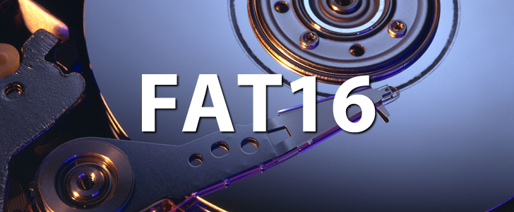

# FAT 16 reader



## What is FAT 16?
FAT (File Allocation Table) is a file system introduced with DOS v1.0. Say the legend that it was written by Bill Gates in person.

## What is a file system?
When you use a computer, you often need to access your files and directories. How does your operating system knows where your data is allocated in disk?
> With a file system! <br/>

Basically it is a data structure (and a method, also) that the operating system uses to control **how** your data is stored and retrieved.

## Clusters, sectors, data?
The FAT file system uses an index table stored on the device to identify chains of data storage areas. Is is called a table because it is basically a linked list of entries for each cluster of data of your file.
> But wait... what is a sector and what is a cluster?

A sector is the smallest addressable unit on a disk. It is tipically a physical division on the storage media.
A cluster, on the other hand, is a logical grouping of sectors. Clusters are the basic allocation units for storing file data. Files are allocated space in whole clusters, even if the actual file size is smaller than the cluster size. The wasted spaced is called internal fragmentation.

The FAT 16 is called this way because it uses 16 bits to address the clusters. The FAT 32, for example, uses 32 bits to address the clusters.


## What does this program do?
The ```main.c``` program reads a FAT 16 image, show the files in the root directory and the user can see what is inside each file.

## How to run the program?
1. First, compile it: ```gcc ./main.c -o main.x``` <br/>
2. Then, execute, passing a image: ```./main.x /PATH/TO/FILE.img```
